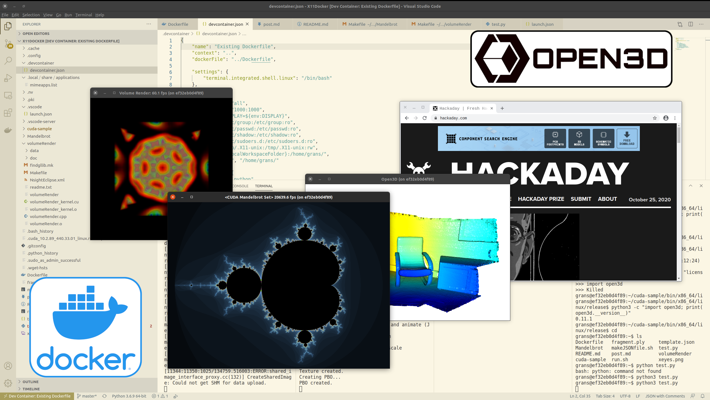
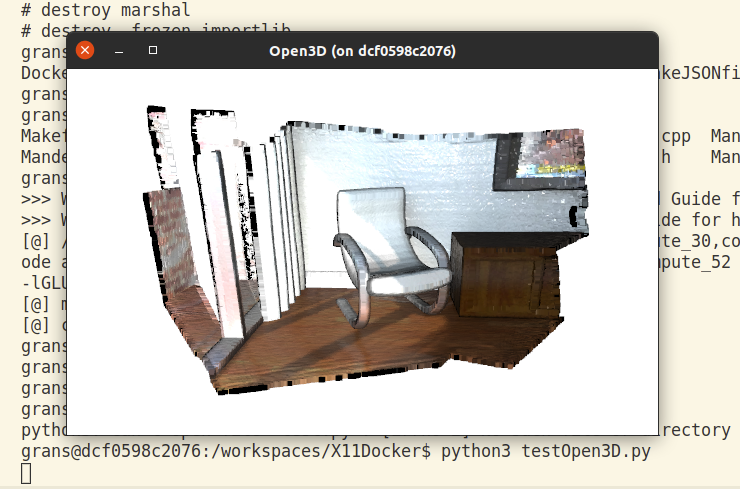
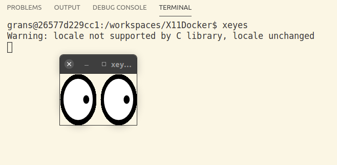
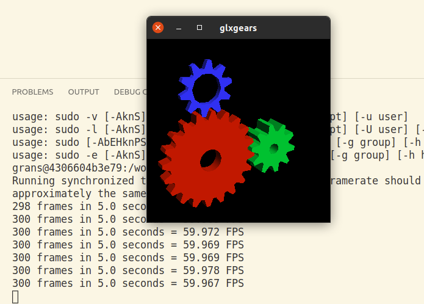

# Open3D in Docker and VS Code

<center>

</center>


Using the Open3D library inside Docker and VS Code sounds like an easy task, but don't be fooled. I made this repo so that you don't have to suffer like I did. There were many hurdles.Thanks to [this](https://github.com/NVIDIA/nvidia-docker/issues/534) issue I figured out that I needed to use the nvidia/cudagl images as my base. 

There are [other](https://github.com/utensils/Envisaged) OpenGL enabled images out there which also might do the trick, but I require CUDA for future projects which is why I chose that one.


## Prerequisites 
* [Remote Development](https://marketplace.visualstudio.com/items?itemName=ms-vscode-remote.vscode-remote-extensionpack) extension


## Installation / Building

```bash
git clone https://github.com/SebastianGrans/Open3DinDocker.git
cd Open3DinDocker
chmod +x makeJSONfile.sh 
# Updates the VS Code devcontainer.json file with your username and 
./makeJSONfile.sh 
```

Open the folder in VS Code 
```
code .
```

Press `Ctrl`+`⇧ Shift`+`P` to open the commande palette and execute the command `Remote-Container: Reopen in container`. This will build and image and start a container. 


## Running Open3D
Run the file `testOpen3D.py`. Either via VS Code (`F5`) or from the terminal: `python testOpen3D.py`. 

> **Note:** When you run this the first time after starting the container, it might take quite a while to import Open3D (~30 sec). Executing `python -vc "import open3d"` indicates that it get stuck at `import 'open3d._build_config'` for a while before rapidly continuing. 

If everything worked you should see the following:  

<center>

</center>


## Running xeyes 
The most basic test. In the integrated terminal, run `xeyes` and you should be greeted with: 

<center>

</center>


## Running glxgears 
`glxgears` is a classic test for checking that OpenGL is working. 

<center>

</center>

<!--
## CUDA samples

Install some dependencies:
```
sudo apt-get install libglu1-mesa libxi-dev libxmu-dev libglu1-mesa-dev freeglut3-dev libglew-dev
```
--> 

## Running Google Chrome / Chromium 
I'm not sure why you would do this, but you can in fact run Chrome from inside a Docker container.

**Chromium**
```
sudo apt install chromium-browser
```
Then run it:
```
chromium-browser --no-sandbox
```


**Google Chrome**
```
sudo apt install wget
wget https://dl.google.com/linux/direct/google-chrome-stable_current_amd64.deb
sudo apt install ./google-chrome-stable_current_amd64.deb
```
Then run it:
```
google-chrome --no-sandbox
```

**Note:** If you want to run it without `--no-sandbox` you can [supposedly](https://github.com/jessfraz/dockerfiles/issues/350#issuecomment-477342782) run the container with the `--privileged` flag. 


## How does it work? 

The command for making X11 forwarding is quite easy and I found it on the [ROS wiki](http://wiki.ros.org/docker/Tutorials/GUI).

You essentially mount all relevant user information files from the host machine into the container and run it using your default user, rather than `root` which is the default. Since you as a user already has permission to the X11 server, it is also permitted from inside the container. 

Building and running in a terminal is easier. 

**Building**  
Inside this repo, run:
```
docker build -t x11docker .
```
This build a new image called `x11docker`.   
Run it: 
```bash
docker run -it \
    --user=$(id -u $USER):$(id -g $USER) \
    --env="DISPLAY" \
    --volume="/etc/group:/etc/group:ro" \
    --volume="/etc/passwd:/etc/passwd:ro" \
    --volume="/etc/shadow:/etc/shadow:ro" \
    --volume="/etc/sudoers.d:/etc/sudoers.d:ro" \
    --volume="/tmp/.X11-unix:/tmp/.X11-unix:rw" \
    --volume="$(pwd):/home/${USER}/" \
    --workdir="/home/${USER}/" x11docker
```
And you should be greeted by a bash promt. 


## Sources that helped me along the way:

* General X11 forwarding in Docker http://wiki.ros.org/docker/Tutorials/GUI
* CUDA Docker image with OpenGL https://github.com/NVIDIA/nvidia-docker/issues/534
* ZSH on the host machine causes problems when mounting https://github.com/microsoft/vscode-remote-release/issues/129#issuecomment-489477113
* Shell commands are not evaluated in the `devcontainer.json`-file https://github.com/microsoft/vscode-remote-release/issues/551
